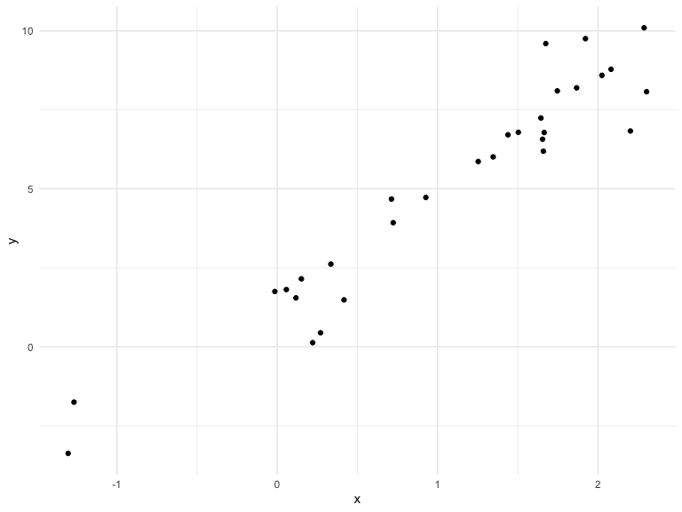

Writing Functions
================
RuiJun Chen
10/24/2019

## Get started

We’re going to write some functions.

Here’s z scores

``` r
x = rnorm(n = 30, mean = 4, sd = 2.3)
x_again = rnorm(n = 30, mean = 6, sd = .3)
y = rnorm(n = 30, mean = 24, sd = 2.3)

(x - mean(x)) / sd(x)
```

    ##  [1]  0.54979606 -0.25290358 -2.21617425 -1.56160995 -1.30072135
    ##  [6]  0.62410869  1.00436671 -1.18531118  1.00288877 -0.29009366
    ## [11]  0.66140601 -1.69282642 -0.21098354 -0.12314805 -0.24843210
    ## [16] -0.71132705 -0.72311377  0.38927699 -0.68221204  0.78629650
    ## [21]  0.01275268  1.23771514  0.80479865 -0.69727088  1.43624343
    ## [26] -0.19144189  1.01761260  0.20905695  2.01264209  0.33860844

``` r
(x_again - mean(x_again)) / sd(x_again)
```

    ##  [1]  1.010699144  0.167020917  0.729547047 -0.132168045 -0.586585317
    ##  [6] -0.241727040 -1.368743846 -0.730162032 -0.124064335  0.543977222
    ## [11] -0.660828457  0.726077159  0.894575030  0.261740397 -1.179936306
    ## [16] -0.045765637 -0.122182318 -0.009455554 -1.046563952 -2.591878125
    ## [21]  0.546641954  0.060005239 -1.221657194 -0.236744891  2.666556328
    ## [26]  0.544083669  1.961527589  0.180762510  0.211889112 -0.206640267

Now a function

``` r
z_score = function(x_arg) {
  if(!is.numeric(x_arg)) {
    stop("x should be numeric")
  } else if (length(x_arg) < 3) {
    stop("x should be longer than 3")
  }
  (x_arg - mean(x_arg)) / sd(x_arg)
  
}
```

Try out the function

``` r
z_score(x_arg = y)
```

    ##  [1]  1.74082495  1.04788400 -0.85779913  1.42139617 -0.26000379
    ##  [6]  0.03663253  0.96094739  0.08272616  0.72927201  1.46411398
    ## [11]  0.46206614  0.42887461 -1.03282728  0.82041806 -2.00352924
    ## [16] -0.34213927  0.84544758  0.27922677 -0.74091163  0.14762095
    ## [21] -0.37656318  0.68142471 -0.90500597 -1.29252732  0.55177226
    ## [26] -2.41806829 -0.99142465  0.14212004 -0.73807766  0.11610912

``` r
z_score(x_arg = 3) 
```

    ## Error in z_score(x_arg = 3): x should be longer than 3

``` r
z_score(x_arg = "my name is jeff") #can't compute mean and std dev of char
```

    ## Error in z_score(x_arg = "my name is jeff"): x should be numeric

``` r
z_score(x_arg = c(TRUE, TRUE, FALSE, TRUE))
```

    ## Error in z_score(x_arg = c(TRUE, TRUE, FALSE, TRUE)): x should be numeric

``` r
z_score(x_arg = iris)
```

    ## Error in z_score(x_arg = iris): x should be numeric

## Multiple outputs

``` r
mean_and_sd = function(input_x) {
  
  if (!is.numeric(input_x)) {
    stop("x should be numeric")
  } else if (length(input_x) < 3) {
    stop("x should be longer than 3")
  } 
  
  list(
    mean_input = mean(input_x),
    sd_input = sd(input_x),
    z_score = (input_x - mean(input_x)) / sd(input_x)
  )
  
}
```

test this function

``` r
mean_and_sd(input_x = y)
```

    ## $mean_input
    ## [1] 24.36825
    ## 
    ## $sd_input
    ## [1] 2.024774
    ## 
    ## $z_score
    ##  [1]  1.74082495  1.04788400 -0.85779913  1.42139617 -0.26000379
    ##  [6]  0.03663253  0.96094739  0.08272616  0.72927201  1.46411398
    ## [11]  0.46206614  0.42887461 -1.03282728  0.82041806 -2.00352924
    ## [16] -0.34213927  0.84544758  0.27922677 -0.74091163  0.14762095
    ## [21] -0.37656318  0.68142471 -0.90500597 -1.29252732  0.55177226
    ## [26] -2.41806829 -0.99142465  0.14212004 -0.73807766  0.11610912

## Multiple inputs

``` r
sim_data = tibble(
  x = rnorm(30, mean = 1, sd = 1),
  y = 2 + 3 * x + rnorm(30, 0, 1)
)

sim_data %>% 
  ggplot(aes(x = x, y = y)) + 
  geom_point()
```



``` r
ls_fit = lm(y ~ x, data = sim_data)
  
beta0_hat = coef(ls_fit)[1] # intercept
beta1_hat = coef(ls_fit)[2] # slope
```

``` r
sim_regression = function(n, beta0 = 2, beta1 = 3) {
  
  sim_data = tibble(
    x = rnorm(n, mean = 1, sd = 1),
    y = beta0 + beta1 * x + rnorm(n, 0, 1)
  )
  
  ls_fit = lm(y ~ x, data = sim_data)
  
  tibble(
    beta0_hat = coef(ls_fit)[1],
    beta1_hat = coef(ls_fit)[2]
  )
}

sim_regression(n = 3000)
```

    ## # A tibble: 1 x 2
    ##   beta0_hat beta1_hat
    ##       <dbl>     <dbl>
    ## 1      1.99      3.00

``` r
sim_regression(n = 3000, beta0 = 17, beta1 = -3) #specifying beta0 intercept and beta1 slope
```

    ## # A tibble: 1 x 2
    ##   beta0_hat beta1_hat
    ##       <dbl>     <dbl>
    ## 1      17.0     -3.01

``` r
sim_regression(n = 14, beta0 = 24)
```

    ## # A tibble: 1 x 2
    ##   beta0_hat beta1_hat
    ##       <dbl>     <dbl>
    ## 1      24.0      2.97
