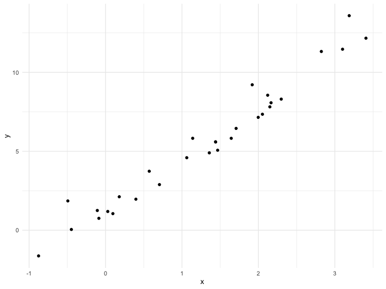

Writing Functions
================
RuiJun Chen
10/24/2019

## Get started

We’re going to write some functions.

Here’s z scores

``` r
x = rnorm(n = 30, mean = 4, sd = 2.3)
x_again = rnorm(n = 30, mean = 6, sd = .3)
y = rnorm(n = 30, mean = 24, sd = 2.3)

(x - mean(x)) / sd(x)
```

    ##  [1] -0.69872782  1.13056185  2.00641685 -2.58618806  0.17807815
    ##  [6]  1.59414336  0.35500578  0.06868434 -0.86143521 -1.26077563
    ## [11] -0.93257121 -0.79138436  0.84537304 -0.16376542 -0.84138984
    ## [16] -0.12550373  0.38303885  0.68254976  1.20634212 -0.82600705
    ## [21] -0.35596746 -0.93232656 -0.69640797  1.25827297 -1.06311815
    ## [26]  0.24341516  1.03959391  0.37471724  0.41695643  0.35241868

``` r
(x_again - mean(x_again)) / sd(x_again)
```

    ##  [1] -0.485002058  1.154418558  0.445873221 -1.018651397  1.610718022
    ##  [6] -0.442007229  0.062709825  0.825159568 -0.422152921 -0.170778529
    ## [11]  0.356601110  0.507909868  2.998955798  0.086381992 -1.764737153
    ## [16] -1.048199119  0.293610603 -0.589534131 -0.345195516 -1.007540344
    ## [21]  0.560020562 -0.788269282 -0.792143623 -0.463653592  0.796308832
    ## [26]  0.008675025  0.072228102 -1.639899514 -0.273338189  1.471531512

Now a function

``` r
z_score = function(x_arg) {
  if(!is.numeric(x_arg)) {
    stop("x should be numeric")
  } else if (length(x_arg) < 3) {
    stop("x should be longer than 3")
  }
  (x_arg - mean(x_arg)) / sd(x_arg)
  
}
```

Try out the function

``` r
z_score(x_arg = y)
```

    ##  [1] -1.78386043  0.42277388  0.84705640  0.73734477  1.12464154
    ##  [6] -0.49216488 -1.08995113  0.53028425 -0.64476744  1.12754440
    ## [11]  0.33461807 -1.11924594  2.08111631 -2.05817697 -0.89689087
    ## [16]  0.81723342 -0.85569206 -0.37515484  1.04580909 -0.48953173
    ## [21]  0.18996971 -0.07067521  1.20731982 -1.20780364  0.33294564
    ## [26] -0.71891995  1.29195940 -0.03299771 -0.76625535  0.51147145

``` r
z_score(x_arg = 3) 
```

    ## Error in z_score(x_arg = 3): x should be longer than 3

``` r
z_score(x_arg = "my name is jeff") #can't compute mean and std dev of char
```

    ## Error in z_score(x_arg = "my name is jeff"): x should be numeric

``` r
z_score(x_arg = c(TRUE, TRUE, FALSE, TRUE))
```

    ## Error in z_score(x_arg = c(TRUE, TRUE, FALSE, TRUE)): x should be numeric

``` r
z_score(x_arg = iris)
```

    ## Error in z_score(x_arg = iris): x should be numeric

## Multiple outputs

``` r
mean_and_sd = function(input_x) {
  
  if (!is.numeric(input_x)) {
    stop("x should be numeric")
  } else if (length(input_x) < 3) {
    stop("x should be longer than 3")
  } 
  
  list(
    mean_input = mean(input_x),
    sd_input = sd(input_x),
    z_score = (input_x - mean(input_x)) / sd(input_x)
  )
  
}
```

test this function

``` r
mean_and_sd(input_x = y)
```

    ## $mean_input
    ## [1] 23.75181
    ## 
    ## $sd_input
    ## [1] 2.200549
    ## 
    ## $z_score
    ##  [1] -1.78386043  0.42277388  0.84705640  0.73734477  1.12464154
    ##  [6] -0.49216488 -1.08995113  0.53028425 -0.64476744  1.12754440
    ## [11]  0.33461807 -1.11924594  2.08111631 -2.05817697 -0.89689087
    ## [16]  0.81723342 -0.85569206 -0.37515484  1.04580909 -0.48953173
    ## [21]  0.18996971 -0.07067521  1.20731982 -1.20780364  0.33294564
    ## [26] -0.71891995  1.29195940 -0.03299771 -0.76625535  0.51147145

## Multiple inputs

``` r
sim_data = tibble(
  x = rnorm(30, mean = 1, sd = 1),
  y = 2 + 3 * x + rnorm(30, 0, 1)
)

sim_data %>% 
  ggplot(aes(x = x, y = y)) + 
  geom_point()
```



``` r
ls_fit = lm(y ~ x, data = sim_data)
  
beta0_hat = coef(ls_fit)[1] # intercept
beta1_hat = coef(ls_fit)[2] # slope
```

``` r
sim_regression = function(n, beta0 = 2, beta1 = 3) { #can set default values for args
  
  sim_data = tibble(
    x = rnorm(n, mean = 1, sd = 1),
    y = beta0 + beta1 * x + rnorm(n, 0, 1)
  )
  
  ls_fit = lm(y ~ x, data = sim_data)
  
  tibble(
    beta0_hat = coef(ls_fit)[1],
    beta1_hat = coef(ls_fit)[2]
  )
}

sim_regression(n = 3000)
```

    ## # A tibble: 1 x 2
    ##   beta0_hat beta1_hat
    ##       <dbl>     <dbl>
    ## 1      2.01      2.99

``` r
sim_regression(3000, 2, 3) #don't need to specify args, can use positional matching
```

    ## # A tibble: 1 x 2
    ##   beta0_hat beta1_hat
    ##       <dbl>     <dbl>
    ## 1      1.97      3.02

``` r
sim_regression(n = 3000, beta0 = 17, beta1 = -3) #specifying beta0 intercept and beta1 slope
```

    ## # A tibble: 1 x 2
    ##   beta0_hat beta1_hat
    ##       <dbl>     <dbl>
    ## 1      17.0     -3.00

``` r
sim_regression(n = 14, beta0 = 24)
```

    ## # A tibble: 1 x 2
    ##   beta0_hat beta1_hat
    ##       <dbl>     <dbl>
    ## 1      24.3      2.86

## Scrape lots of napoleon

``` r
url = "https://www.amazon.com/product-reviews/B00005JNBQ/ref=cm_cr_arp_d_viewopt_rvwer?ie=UTF8&reviewerType=avp_only_reviews&sortBy=recent&pageNumber=1"

dynamite_html = read_html(url)

review_titles = 
  dynamite_html %>%
  html_nodes("#cm_cr-review_list .review-title") %>%
  html_text()

review_stars = 
  dynamite_html %>%
  html_nodes("#cm_cr-review_list .review-rating") %>%
  html_text()

review_text = 
  dynamite_html %>%
  html_nodes(".review-text-content span") %>%
  html_text()

reviews = tibble(
  title = review_titles,
  stars = review_stars,
  text = review_text
)
```

Now as a function

``` r
read_page_reviews = function(page_url) { 
  
  dynamite_html = read_html(page_url)
  
  review_titles = 
    dynamite_html %>%
    html_nodes("#cm_cr-review_list .review-title") %>%
    html_text()
  
  review_stars = 
    dynamite_html %>%
    html_nodes("#cm_cr-review_list .review-rating") %>%
    html_text()
  
  review_text = 
    dynamite_html %>%
    html_nodes(".review-text-content span") %>%
    html_text()
  
  reviews = tibble(
    title = review_titles,
    stars = review_stars,
    text = review_text
  )
  
  reviews
    
} #can use option-click to put cursor across multiple lines/selection
```

Now i can read a lot of page reviews\! Although I’m back to
copy-and-pasting code
…

``` r
read_page_reviews("https://www.amazon.com/product-reviews/B00005JNBQ/ref=cm_cr_arp_d_viewopt_rvwer?ie=UTF8&reviewerType=avp_only_reviews&sortBy=recent&pageNumber=1")
```

    ## # A tibble: 0 x 3
    ## # … with 3 variables: title <chr>, stars <chr>, text <chr>

``` r
read_page_reviews("https://www.amazon.com/product-reviews/B00005JNBQ/ref=cm_cr_arp_d_viewopt_rvwer?ie=UTF8&reviewerType=avp_only_reviews&sortBy=recent&pageNumber=2")
```

    ## # A tibble: 0 x 3
    ## # … with 3 variables: title <chr>, stars <chr>, text <chr>

``` r
read_page_reviews("https://www.amazon.com/product-reviews/B00005JNBQ/ref=cm_cr_arp_d_viewopt_rvwer?ie=UTF8&reviewerType=avp_only_reviews&sortBy=recent&pageNumber=3")
```

    ## # A tibble: 0 x 3
    ## # … with 3 variables: title <chr>, stars <chr>, text <chr>

``` r
read_page_reviews("https://www.amazon.com/product-reviews/B00005JNBQ/ref=cm_cr_arp_d_viewopt_rvwer?ie=UTF8&reviewerType=avp_only_reviews&sortBy=recent&pageNumber=4")
```

    ## # A tibble: 0 x 3
    ## # … with 3 variables: title <chr>, stars <chr>, text <chr>

## Function as argument

``` r
x = rnorm(25, 0, 1)

my_summary = function(x, summ_func) {
  summ_func(x)
}

my_summary(x, sd)
```

    ## [1] 0.9662027

``` r
my_summary(x, IQR)
```

    ## [1] 1.221061

``` r
my_summary(x, var)
```

    ## [1] 0.9335477

## Scoping

Mean example …

``` r
f = function(x) {
  z = x + y
  z
}
x = 1
y = 2
x = y
x = 3
y #setting x = y just sets value, not memory pointer
```

    ## [1] 2

``` r
f(x = y)
```

    ## [1] 4

``` r
f(x = 2) #uses local x from arg in addition to global y
```

    ## [1] 4
